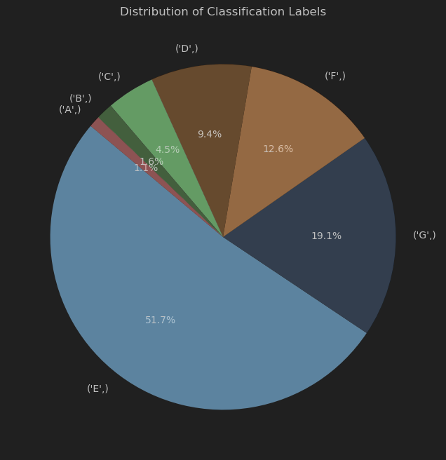

# Building EPC Progress

---

The dataset used in this project can be found [here](https://analisi.transparenciacatalunya.cat/en/Energia/Certificats-d-efici-ncia-energ-tica-d-edificis/j6ii-t3w2/data_preview)

This is where you ar going to track your progress and add your taks, 

-[ ] Uncompleted
- analyse the results
- what is the visual meaning of the data
- what are the ranges of the variables

# Addressing overfitting and underfitting, Given the class imbalance in the EPC data

1. Data Augmentation and Resampling
Over-sampling minority classes: Use techniques like SMOTE (Synthetic Minority Over-sampling Technique) to create synthetic examples of the minority classes.
Under-sampling majority classes: Randomly under-sample the majority class to balance the dataset.
Combination of over-sampling and under-sampling: Use a hybrid approach to balance the dataset.
2. Regularization Techniques
L1/L2 Regularization: Add regularization terms to the loss function to penalize large weights.
Dropout: Randomly drop units (along with their connections) from the neural network during training to prevent co-adaptation of features.
3. Cross-Validation
K-Fold Cross-Validation: Use cross-validation to ensure the model generalizes well to unseen data and to prevent overfitting.
Stratified K-Fold Cross-Validation: Use stratified k-fold cross-validation to ensure each fold has the same proportion of each class as the original dataset.
4. Ensemble Methods
Bagging (Bootstrap Aggregating): Train multiple models on different subsets of the data and average their predictions.
Boosting: Combine weak learners into a strong learner by focusing on the errors made by previous models.
5. Model Complexity
Simplify the model: Use a less complex model to avoid overfitting.
Hyperparameter tuning: Use grid search or random search to find the optimal hyperparameters for your model.
6. Early Stopping
Early Stopping: Monitor the model's performance on a validation set and stop training when performance starts to degrade.
7. Feature Engineering
Feature Selection: Remove irrelevant or redundant features to reduce the complexity of the model.
Feature Scaling: Normalize or standardize features to improve convergence during training.
8. Data Split
Train-validation-test split: Ensure you have a proper split of your data into training, validation, and test sets to evaluate the model's performance accurately.
- 
-[x] Completed 

---
## 18/06/2024
Corne:

Over fitting can be as a result of many things. 

One of the first things you showed us was your pie chart. 

Start with the simple stuff, fix this first using suitable methods and then show us the before and after performance 
of your model. Make sure you know and understand why the model overfits when there is a class imbalance in your dataset and what option there exist to remedy it. 

Also, use your Jupyter notebook to tell the story of what you are doing. For example, after you load your dataset, 
you want to explore the data. Perform an exploratory data analysis(EDA). The goal is to understand your data. 
Why is it important? Because it will give you an indication of what kind of model you need to use, and you need to be able to tell whether your models output makes sense or not.  
The pie chart showing the output class distribution is only one of the elements. What other things should you look at?
Ask ChatGPT but also read highly cited papers and see what how they conduct their research. Look on Kaggle for examples
of EDA. 

Once you understand your data, you preprocess it and then you move to training models. For every result that is displayed, tell us what you see and what you think it means. You are the expert now and all of us want to know more. 

## 24/06/2024

Dumo:
What youve done and where we can find it:
-SMOTE is applied to balance the dataset by oversampling the minority classes.
A pie chart is created to visualize the balanced distribution of the EPC labels after applying SMOTE.
-Synthetic Minority Over-sampling Technique (SMOTE) is used to generate synthetic samples of the minority class to balance the dataset. This helps the model learn the decision boundaries for all classes effectively.
#Why Class Imbalance Causes Issues:
-Overfitting on Majority Class: The model may become biased towards the majority class because it sees more examples of it. This can lead to high accuracy but poor performance on minority classes.
-Underfitting on Minority Class: The model may not learn the characteristics of the minority classes well because it sees fewer examples, leading to poor predictive performance for these classes.

#Strategies to Balance the Dataset:
Resampling Techniques:
-Oversampling the Minority Class: This involves adding more copies of the minority class. Techniques include Random Oversampling and SMOTE (Synthetic Minority Over-sampling Technique).
-Undersampling the Majority Class: This involves reducing the number of instances of the majority class. Techniques include Random Undersampling and Cluster-Based Undersampling.

